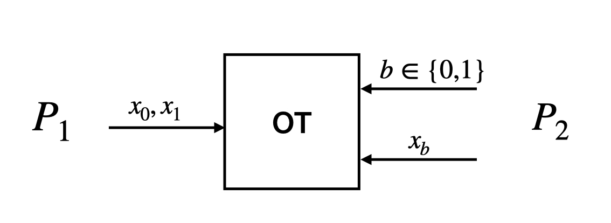

# Multi-Party Computation (MPC)

!!! summary
    Functionality in which two or more parties with secret inputs compute a joint function on those inputs. No party learns any more information about the others' inputs, except what it can infer from the output. 

Sometimes also referred to as secure multi-party computation (SMC), multi-party computation (MPC) is a functionality in which two or more parties with secret inputs want to compute a joint function $f$ on those inputs. More explicitly, for N parties with inputs $x_1, \ldots, x_N$, an MPC protocol takes those inputs and outputs $y := f(x_1, \ldots, x_N)$.

The protocol should meet a couple of conditions to be interesting/useful:

- **Security.** None of the parties learn anything about the other parties' inputs (except what they can deduce from the output)
- **Correctness.** $y$ should be [correct](../general.md#correctness). That is, $y$ should in fact be the function $f$ applied to the parties' inputs – no errors.

Why is this useful? A simple example is Yao's Millionaries' Problem. 

!!! example 
    Two millionaires want to know who's richer, but they don't want to reveal exactly how rich they are. They can run an MPC protocol where the inputs are their net worths and the function $f$ computes the sign of $x_1 - x_2$. $f$ could be defined as

    $$f(x_1, x_2) = \begin{cases}
    1 	& x_1 > x_2\\
    0 	& x_1 = x_2\\
    -1 	& x_1 < x_2
    \end{cases}$$

There are more serious real-world applications for this too. You could imagine using this to let hospitals collaborate on health analytics without sharing their patient records and other similar use cases.

## Building Blocks

**Beaver Triples**
: For any variable $d$, let $[d]$ denote a party's share of $d$. Assuming parties hold [secret shares](#secret-sharing) of values $x,y,a,b,c=ab$ for uniform $a,b$, they can compute shares of $z=xy$ as follows:

1. Publicly reconstruct $x-a, y-b$:
    - Locally compute shares of $x-a, y-b$
    - Broadcast shares to reconstruct
1. Use local computation to get shares of $z$:
    - Each party sets its share $[z] = [c] + (y-b)[x] + (x-a)[y] - (x-a)(y-b)$
    - Note that these are shares of $xy$!

**Cut-and-choose**
: This is an idea used to turn a [semi-honest](../general.md#semi-honest) MPC protocol into a [malicious-secure](../general.md#malicious) one. Whenever we rely on the well-formedness of some (potentially malicious) party's inputs, we use the following idea to guarantee their well-formedness: we ask the party to generate many values, then challenge it on a randomly selected fraction of them. The party opens this subset, and if they are all well-formed/honestly generated, the unopened half is used in the protocol. By a [statistical argument](../general.md#statistical), these are very likely also well-formed.

**Oblivious Transfer (OT)** { #ot }
: Functionality in which one party holds two strings and the other a selection bit _b_. The second party learns the string corresponding to its selection bit and nothing more, while the first party learns nothing about the selection bit.  
  
OTs with different numbers exist, such as 1-out-of-4 OT ($P_2$ selects one of four choices) or more generally 1-out-of-$n$ OT for some parameter $n$.

!!! example "Construction: Naor-Pinkas OT"

    === "Construction"

**Secret-sharing** { #secret-sharing }
: Splitting a secret between parties so that none of the parties know the secret, but they each have a piece of the information, and if they work together they can recover the secret. Here's a visual intuition:  
   
Some classic schemes are:

    !!! example "Exclusive OR (XOR, $\oplus$) secret-sharing"

        For a secret $s$, set Party $i$'s share to some random value $r_i$, except for a designated party which gets $s \oplus r_1 \oplus \ldots \oplus r_N$. The shares XOR together to $s$, but each individual share looks random.
    !!! example "Shamir secret sharing"
        This is a form of $(t+1)$-out-of-$n$ secret-sharing, i.e., at least $t+1$ out of $n$ parties must work together to recover the secret. Shamir secret-sharing gives every party a point on a degree-t polynomial. Because t+1 points define a unique polynomial, t+1 parties can work together to recover it. The secret is the value when the polynomial is evaluated at 0. Interactive demo [here](./ShamirSS.ipynb).

: Secret-sharing schemes with additional properties also exist and are sometimes helpful for constructing MPC.

- **Function secret sharing (FSS)**:
- **Homomorphic secret sharing (HSS)**:
- **Robust secret sharing**: Does not consider a corrupt dealer. ...
- **Verifiable secret sharing (VSS)**: Protects against a corrupt dealer. Parties who receive shares from the dealer can also run a verification function to confirm that the shares they received are well-formed (are consistent with each other).

!!! example "Feldman VSS [[Fel87](https://www.cs.umd.edu/~gasarch/TOPICS/secretsharing/feldmanVSS.pdf)]"

    === "Construction"
        Choose a DLog-hard subgroup $G$ of $\mathbb{Z}_p$ such that $G$ is of order $q$ with generator $g$. The dealer shares the secret $s$ as in regular Shamir secret sharing, using some degree-t polynomial $P(x) = s + a_1 x + \ldots + a_t x^t \pmod{q}$.
        
        For verifiability, the dealer includes [commitments](../Cryptographic-Primitives/commitments.md) to the coefficients of $P$, calculated as 
        
        \[c_0 := g^s, c_1 := g^{a_1}, \ldots, c_t := g^{a_t} \in \mathbb{Z}_p\]
        
        To verify that some share $sh = P(i)$, party $i$ (working in $\mathbb{Z}_p$) checks that
        
        \[ g^{sh} =^? c_0 c_1^i \cdots c_t^{i^t} \pmod{p}\]
        
        Note that if the share and the commitments are well-formed, this equals $g^{s + a_1 i + \ldots + a_t i^t} = g^{P(i)}$.

    === "Properties"
        - Computationally secure (by [DLog](../assumptions.md#discrete-logarithm) assumption)

**MPC-in-the-head**
: 

## Protocol Parameters

**Communication complexity**
: The amount of data (the size of the messages) exchanged between parties in the protocol. This lower bounds the bandwidth required to run the protocol.

**Corruption type**
: [Semi-honest](../general.md#semi-honest), [malicious](../general.md#malicious), etc.

**Corruption threshold** ($t$)
: Honest majority ($t < n/2$), dishonest majority ($t < n$), etc.

**Hardness assumptions**
: The [computational hardness assumption(s)](/assumptions) underlying the security of the protocol.

**Round complexity**
: The number of rounds in the protocol. This lower bounds the time required to complete the protocol.

    !!! info
        The optimal round complexity of an MPC protocol is 2 rounds. <!-- (achieved by ??) -->

**Trusted setup**
:  

### **Security guarantees**

**Fairness**
: Either all parties learn the output, or no party does. Put in other words, the [malicious](../general.md#malicious) party/ies cannot learn the output without also revealing it to all honest parties.

**Guaranteed output delivery (GOD)**
: The strongest type of correctness guarantee. In a protocol with GOD, an adversary cannot even carry out a denial-of-service attack; the (correct) output will always be learned by the participants.  

**Identifiable abort**
: If the protocol fails, the honest parties learn which corrupted party was the cause.

**Security with abort**
: The protocol is secure, but an adversary can still cause it to abort.

## Generic Protocols

These are MPC protocols that work for any function. Most protocols turn the function to be computed into a circuit representation (yes, like in electrical engineering with AND gates and whatnot). 

**Yao's Garbled Circuits (GC)** { #gc }
: One party (the garbler) "garbles" the circuit by successively encrypting wire keys. The other party (the evaluator) follows the path of correct decriptions through the circuit until it obtains the keys corresponding to the output value. [[Original paper](https://ieeexplore.ieee.org/document/4568207)]

    !!! note ""
        _Building blocks:_ [Secure OT](#ot)  
        _Optimizations:_ Point-and-permute, [PRF](../Cryptographic-Primitives/other.md#prf) for encryption, garbled row reduction, half-gates, free XOR.

**Goldreich–Micali–Wigderson (GMW)** ([semi-honest](../general.md#semi-honest) version) { #gmw }
: Construct gates so that parties can step through the circuit using XOR-shares of wires. Multiplication gates require 1-out-of-4 [OT](#ot) to communicate the correct output shares.  

    !!! note ""
        _Building blocks:_ [Secure OT](#ot)

**Goldreich–Micali–Wigderson (GMW)** (malicious version)
: Same as semi-honest, but use zero-knowledge proofs to ensure well-formedness.  

    !!! note ""
        _Building blocks:_ [Secure OT](#ot), [ZKPs](../Areas-of-Cryptography/zk.md)

**Ben-Or–Goldwasser–Wigderson (BGW)** { #bgw }
: Same structure as GMW but over arithmetic circuits (where wires carry [field](../general.md#field) elements). So, instead of using XOR-shares, use $(t+1)$-out-of-$n$ Shamir [secret-sharing](#secret-sharing). Multiplication gates use a degree-reduction step to maintain the invariant that parties hold well-formed wire value shares. [[full proof](https://eccc.weizmann.ac.il//report/2011/036/)]

    !!! note ""
        _Assumptions:_ None!

**Chaum–Crepeau–Damgård (CCD)** { #ccd }
:  

**Beaver–Micali–Rogaway (BMR)** { #bmr }
: This can be viewed as an adaptation of [Yao's garbled circuit](#gc) approach to more than two parties while keeping its low round complexity. The idea is to use [GMW](#gmw) to compute a garbled circuit for the function to be evaluated; then, one party evaluates the garbled circuit.
[[Original paper](https://dl.acm.org/doi/pdf/10.1145/100216.100287?casa_token=jgHhj-wpD88AAAAA:17nxjtduFXBZwYyyvRd9sVKdnPBXZ-vaBxXxzmHFQwhZy_dRc1UGxRnmoXj6WlNRflZ-wRlQA0v-iA)]
[[Rogaway's Thesis](https://www.cs.ucdavis.edu/~rogaway/papers/thesis.pdf)]
[[Pragmatic Introduction to MPC, Section 3.5](https://securecomputation.org/)]

    !!! note ""
        _Assumptions:_ [Secure OT](#ot)

**Cramer–Damgård–Nielsen (CDN)** { #cdn }
: 

    !!! note ""
        _Building blocks:_ Threshold homomorphic encryption

### Tabular Summary

$n$: number of circuit gates

$d$: depth of circuit  

Year | Name | Number of parties | Threat Model | Round Complexity | Communication Complexity | Circuit Representation
:----|:----------------|:-----------------:|:-------------|:----------------:|:-----------------------:|:-----------
1986 | [Yao's GC](#gc) | 2    | <2 semi-honest     | $O(1)$ | $O(n)$ | Boolean
1987 | [GMW](#gmw)     | many | <$n$ semi-honest   | $O(d)$ | $O(1)$ | Boolean
&#8203;|               | many | <$n$ malicious     |        |        | Boolean
1988 | [BGW](#bgw)     | many | <$n/2$ semi-honest | $O(d)$ | $O(d)$ | Arithmetic
&#8203;|               | many | <$n/3$ malicious   | $O(d)$ |        | Arithmetic
1988 | [CCD](#ccd)     | many |                    |        |        |
1990 | [BMR](#bmr)     | many | <$n$               | $O(1)$ |        | Boolean
2001 | [CDN](#cdn)     | many | <$n/2$ malicious   | $O(d)$ | $O(n)$ | Arithmetic

## MPC Extensions

**Non-interactive MPC (NI-MPC)**
: 

**Non-interactive 2PC**
: 

## Special-Purpose MPC

When considering only a specific class of functions, we can often come up with faster protocols that are specially tailored to the problem.

**Private set intersetion (PSI)** { #psi }
: Two parties, each with their own set, want to compute the intersection of these sets without revealing any of the elements not in the intersection.<!-- add use case -->  