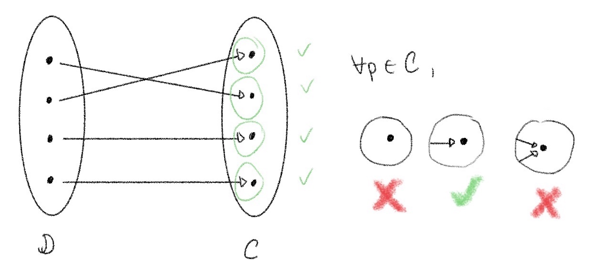
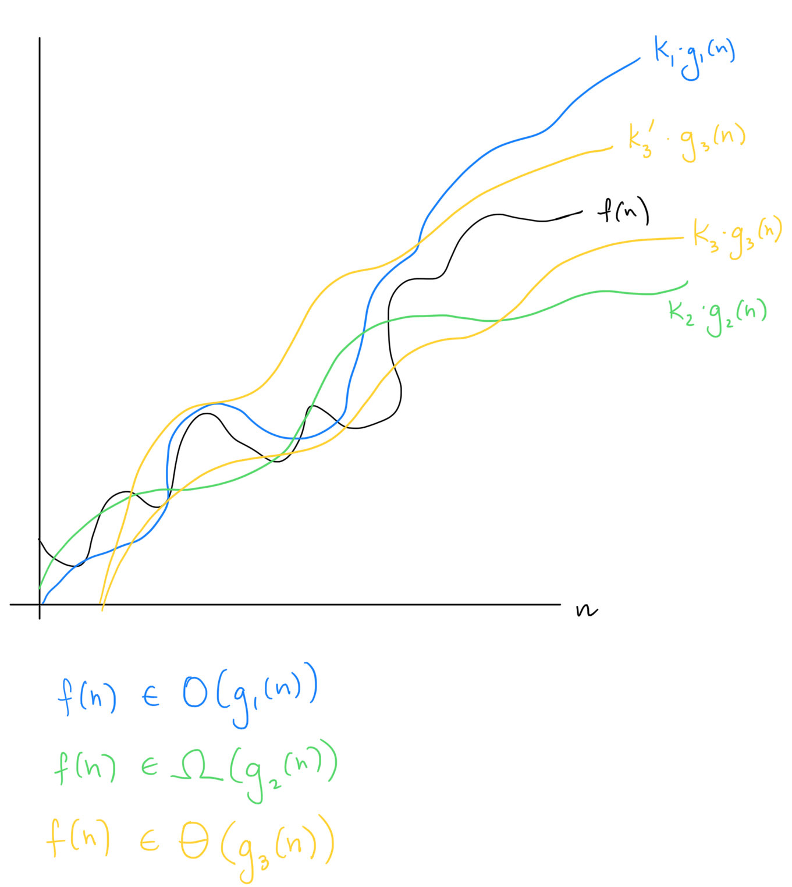
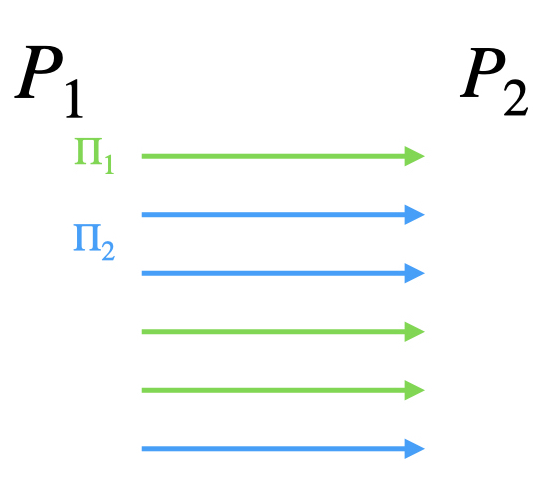
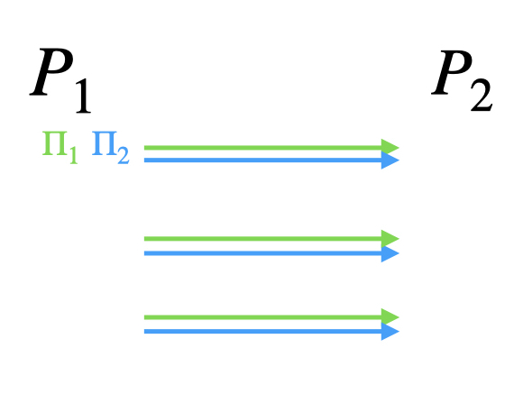

# General

**Advantage** { #advantage }
: The probability of an [adversary](#adversary) violating the security property of a scheme. The advantage is generally defined with respect to a [security game](#game). For secure constructions, the adversary's advantage usually shown to be small by showing it is bounded by a [negligible function](#negligible).

**Adversary** { #adversary }
: Some dishonest entity that will try to break a primitive or protocol. See [Threat Models](#threat-models) for the types of adversaries, each with different capabilities.

**Bijective** { #bijective }
: A function which is both [injective](#injective) and [surjective](#surjective), that is, every element in the codomain has exactly one preimage in the domain. This implies that the domain and codomain have equal cardinalities (any element of the domain that doesn't map to anything is, by definition, not included in the domain).

**Black-box** { #black-box }
: Treating some algorithm or protocol as a "black box" that hides the inner mechanism, allowing only the inputs and outputs to be seen. For instance, _black-box constructions_ are constructions that use some building block as a black box without caring about its inner workings (only its generic input-output behavior).

**Correctness** { #correctness }
: A property of a scheme that ensures it works correctly and does not trivially meet the definition of the scheme. For example, we usually require that [decryption and encryption](./Cryptographic-Primitives/encryption.md) are inverses, or that [sharing and reconstruction](./Areas-of-Cryptography/mpc.md#secret-sharing) are inverses.

**Cryptographic Primitives**
: Basic building blocks for cryptographic protocols.

**Deterministic** { #deterministic }
: A function that always proceeds in the same way when run on the same outputs. Alternatively, the inputs directly determine the output. Compare to [randomized](#randomized).

**Feasibility result**
: 

**Field** { #field }
: A set of elements F with two binary operations + and • (addition and multiplication) that satisfy a set of properties called the [field axioms](https://en.wikipedia.org/wiki/Field_(mathematics)#Classic_definition) (specifically associativity, commutativity, identity, and invertibility of both operations along with distributivity of multiplication over addition). Both the rational numbers and the real numbers are fields.

**Functionality**
: A particular set of capabilities or properties to be achieved. For example, many protocols exist that implement the functionality of [public key encryption](./Cryptographic-Primitives/encryption.md#pke). In this way, a functionality is abstract and independent of implementation details, and cryptosystems are build to achieve a functionality. Often, to prove security, a protocol is compared to an [ideal functionality](#ideal-functionality), to show that it meets the same security properties.

**Function**
: A mathematical object that maps each input to at most one output.

**Group** { #group }
: A set of elements $G$ with some binary operation • (the group operation) that satisfies a set of properties called the [group axioms](https://en.wikipedia.org/wiki/Group_(mathematics)#Definition) (specifically associativity, identity, and invertibility). The integers form a group under addition.

**Hardness assumption**
: A problem, such as [factoring](./assumptions.md#factoring), which is assumed to be hard. A cryptographic scheme's security may hinge on the [adversary](#adversary) not being able to solve this problem, and if the assumption turns out not to hold, the proof of security is invalidated. See [Assumptions](./assumptions.md) for more details.

**Independent and identically distributed (i.i.d.)** { #iid }
: Two random variables are i.i.d. if they have the same probability distribution and are independent of each other.

**Indistinguishable** { #indist }
: Indistinguishability refers to how hard two probability distributions are to tell apart.  

    **Perfectly indistinguishable** { #perfect-indist }
    : Two distributions are perfectly indistinguishable if they are identical: they are the same distribution.

    **Statistically indistinguishable** { #stat-indist }
    : Two distributions are statistically indistinguishable if they are statistically "close", ... <!-- TODO -->

    **Computationally indistinguishable** { #comp-indist }
    : Two distributions are computationally indistinguishable if distinguishing them would require solving some [computationally intractable problem](./assumptions.md).

**Injective** { #injective }
: A function such that every element of the codomain is the image of at most one element of the domain. Equivalently, $f(a)=f(b)$ implies $a=b$.Also known as **one-to-one**. Compare to [surjective](#surjective), [bijective](#bijective).

**Linear operations**
: Addition and scalar multiplication.

**Negligible function** { #negligible }
: A function that asymptotically (i.e. after some fixed point) decreases faster than any inverse polynomial:  

!!! info "Formal Definition"
    A function $f$ is negligible if for all natural numbers c, there exists a natural number $N$ such that $f(n) < n^{-c}$ for all $n > N$.

**Parameterized**
: 

**Probabilistic polynomial time (PPT)** { #ppt }
: A potentially [probabilistic](#probabilistic) algorithm that runs in polynomially many steps. In cryptography, we usually consider PPT [adversaries](#adversary) (polynomial in the [security parameter](#secparam)).

**Protocol** { #protocol }
: A sequence of messages exchanged between parties to compute some functionality. A protocol specifies how parties should compute their messages based on their knowledge and the other parties' responses. Usually denoted by the variable &Pi;.

**Probabilistic** { #probabilistic }
: 

**Randomized** { #randomized }
: A function whose output is influenced by some additional source of randomness. Running the function twice on the same inputs may result in a different outcome. Compare to [deterministic](#deterministic).

**Ring** { #ring }
: 

**Security game** { #game }
: A game is a challenge in which an attacker (called the [adversary](#adversary) and usually denoted by a curly letter $\mathcal{A}$) is given some information and tries to break the security property of the scheme. $\mathcal{A}$ "wins" the game if it can give an answer that proves it broke the security property of the scheme. For an example, see the [CPA-security game](./Cryptographic-Primitives/encryption.md#cpa-security). See also [Game-based proofs](./proofs.md#game-based-proofs).  
A security game is sometimes also called an **experiment**.

**Security parameter**
: Denoted by $\lambda$ (or sometimes $\kappa$), this is a measure of how hard it is to break the security of a system. 
Generally, an adversary's [advantage](#advantage) in attacking a scheme should be [negligible](#negligible) in the security parameter; thus, the parameter needs to be large enough that the specific [negligible function](#negligible) also corresponds to a sufficiently low success probability in practice.
Computational security parameters are generally $\lambda = 128$ or $\lambda = 256$ and correspond to the size of the instance of the computational problem to be solved; [information-theoretic](#it-security) security parameters can be lower and correspond directly to an [adversary](#adversary)'s statistical success probability. [See also the [Wikipedia page](https://en.wikipedia.org/wiki/Security_parameter)]

**Surjective**
: A function such that every element of the codomain has at least one preimage in the domain. Also known as **onto**. Compare to [injective](#injective), [bijective](#bijective).

**Sybil attack**
: Attack in which an [adversary](#adversary) creates multiple fake identities (parties) it controls in order to increase its influence in a network. To an outside observer these machines can't be distinguished from other honest parties/identities. One way to prevent this is asking new users to perform a somewhat costly registration process as a way to rate-limit creating new identities.

**Uniform** { #uniform }
: A distribution is uniform, or a value uniformly distributed, if every outcome is equally likely. We may say that a value is "drawn uniformly at random". A uniform distribution over N elements means each of the elements is drawn with probability 1/N.

**Unary**
: Compared to binary, which represents numbers using two symbols (0 and 1), the unary representation of a number consists only of 1s. Specifically, a number $n$ is represented in unary as a string of $n$ 1s (e.g., 5 in unary would be 11111). [Security parameters](#secparam) are usually given as an input in their unary representation, i.e. $1^\lambda$.

**"Without loss of generality"**
: This means that only one particular case is analyzed, but the argument holds equally in the other cases.

## Complexity Theory

**Big-O notation**
: Written $O(g(n))$ for some function $g$, this is an *upper bound* on the computational complexity of an algorithm/protocol/etc. when $n$ is large enough (i.e., an asymptotic bound). Put another way, $f(n) \in O(g(n))$ means $f(n)$ grows asymptotically *no faster* than $g(n)$.

**Big-omega notation**
: Written $\Omega(g(n))$ for some function $g$, this is a *lower bound* on the computational complexity of an algorithm/protocol/etc. when $n$ is large enough (i.e., an asymptotic bound). Put another way, $f(n) \in \Omega(g(n))$ means $f(n)$ grows asymptotically *no slower* than $g(n)$.

**Big-theta notation**
: Written $\Theta(g(n))$ for some function $g$, this is an *approximation* of the computational complexity of an algorithm/protocol/etc. when $n$ is large enough (i.e., an asymptotic bound). Put another way, $f(n) \in \Theta(g(n))$ means $f(n)$ grows asymptotically *at the same rate* as $g(n)$.  
Note: $f(n) \in \Theta(g(n)) \iff f(n) \in O(g(n))$ and $f(n) \in \Omega(g(n))$.

{ width=500px }

!!! tip "Further Reading"
    Khan Academy has good explanations of the concepts of [Big-O](https://www.khanacademy.org/computing/computer-science/algorithms/asymptotic-notation/a/big-o-notation), [Big-Omega](https://www.khanacademy.org/computing/computer-science/algorithms/asymptotic-notation/a/big-big-omega-notation), and [Big-Theta](https://www.khanacademy.org/computing/computer-science/algorithms/asymptotic-notation/a/big-big-theta-notation), and the diagrams and wording here are based on those pages and a nice summary comment by the user Cameron.

**Polylog(n)**
: Polynomial in the logarithm, i.e. $poly(\log(n))$.

### Complexity Classes

**P**
: The class of decision problems (i.e., decide if $x$ is an instance of some language $L$; see also [ZK background](./Areas-of-Cryptography/zk.md#background)) solvable in polynomial time by a Turing machine. Put another way, this is the class of decision problems solvable by a uniform family of polynomial-size Boolean circuits[^1].

[^1]: in logspace, i.e. using O(log(n)) memory.

**P/poly**
: Same as the class _P_ except that the Turing machine is allowed a trusted "advice string" of size $O(poly(n))$, where $n$ is the size of the input. This is also known as the non-uniform version of _P_, since the Turing machine can depend on the specific instance in question and can therefore vary widely between instances (modeled by using the advice string to inform the Turing machine's layout).

**PPAD**
: 

**NC**
: "Nick's Class." **NC$^i$** is the class of decision problems solvable by a uniform family of poly-size Boolean circuits (so far, same as _P_) of _depth $O(log^{i}(n))$ and fan-in 2_. (Therefore, NC$^0$ is the class of decision problems solvable by constant-depth bounded fan-in circuits.) Then **NC** is the union of NC$^i$ over all $i \geq 0$.  

    It is known that NC &subseteq; P.

**TC$^0$**
: The class of decision problems solvable by poly-size *constant-depth* circuits with *unbounded* fan-in using AND, OR, NOT, and threshold gates.  

    It is known that TC$^0$ &subseteq; NC$^1$.

!!! tip "Further Reading"
    Many more complexity classes can be found on the [Complexity Zoo wiki](https://complexityzoo.net/Complexity_Zoo).

## Composition

**Concurrent composition** { #concurrent-comp }
: Two protocols $\Pi_1, \Pi_2$ running concurrently are run with their messages arbitrarily interleaved. In the two-party case:  
{ width=300px }  
In general, concurrent composition of secure protocols does not maintain security (against [malicious adversaries](#malicious)). A special case of concurrent composition is [parallel composition](#parallel-comp). Compare to [sequential composition](#sequential-comp).

**Parallel composition** { #parallel-comp }
: Two protocols $\Pi_1, \Pi_2$ running in parallel run in "lockstep", i.e. the first round messages of both are sent together, followed by the second, and so on. In the two-party case:
{ width=300px }  
In general, composing secure protocols in parallel does not maintain security (against [malicious adversaries](#malicious)). Parallel composition is a special case of [concurrent composition](#concurrent-comp). Compare to [sequential composition](#sequential-comp).

**Hybrid composition** { #hybrid-comp }
: <!-- TODO --> 
!!! info "Composition Theorem"
    If $\rho_1, \ldots, \rho_m$ are secure protocols for computing the functionalities $f_1, \ldots, f_m$, and if $\Pi$ is a secure protocol for computing $f$ in the $(f_1, \ldots, f_m)$-[hybrid](./proofs.md#hybrid-arg) world, then the composed protocol $\Pi^{\rho_1, \ldots, \rho_m}$ is a secure protocol for $f$. That is, if we have a protocol that can secure compute some function $f$ given it has access to some other functionality/ies, and we have protocols for securely computing those functionality/ies, we can "plug in" those protocols into our main protocol and it will be secure.

**Sequential composition**
: Two protocols are composed sequentially when they are run back-to-back, i.e. one protocol only begins after the other has concluded. In the two-party case:  
{ width=300px }  
Sequential composition of two secure protocols is still secure! Compare to [concurrent composition](#concurrent-comp), [parallel composition](#parallel-comp).

## Threat Models

**Malicious adversary** { #malicious }
: An [adversary](#adversary) that can deviate arbitrarily from the [protocol](#protocol) it is participating in. That is, it doesn't follow the rules and may send malformed, empty, or incorrect messages, not send a message when it is supposed to or vice versa, and otherwise behave maliciously. Also known as **active adversary**; compare to [semi-honest adversary](#semi-honest).

!!! note "Notation"
    We sometimes use * as a superscript to denote that a party may be malicious, i.e. cheat and deviate from the protocol. For instance, the party $S^*$ in a commitment scheme denotes a potentially malicious sender.

**Semi-honest adversary** { #semi-honest }
: An [adversary](#adversary) that follows the [protocol](#protocol) and acts honestly, but tries to learn as much as possible from the information it sees. Also known as **honest-but-curious (HbC)** or **passive**.

!!! warning "Less standard threat models"
    The following threat models are newer and thus less widely used than the ones until now. It's possible different papers use different terms for them or that the names will change in the future.

**Fail-stop adversary**
: Slightly stronger than the [semi-honest adversary](#semi-honest); follows the [protocol](#protocol) the way a [semi-honest adversary](#semi-honest) does, but can choose to abort at any time (or cause parties it controls to abort).

**Semi-malicious adversary**
: Lies between the [semi-honest](#semi-honest) and [malicious cases](#malicious). The [adversary](#adversary) must follow the [protocol](#protocol), but it can arbitrarily and [adaptively](#adaptive) choose the inputs and randomness used in the protocol. [[BHP17 §4](https://eprint.iacr.org/2017/386.pdf); introduced by [AJL+12 §5](https://www.tau.ac.il/~tromer/papers/tfhe-mpc.pdf)]

**Uniform adversary**
: A uniform [adversary](#adversary) uses the same strategy regardless of the protocol instance. Compare to [non-uniform adversary]().

## Security Definitions & Notions

**Adaptive security** { #adaptive }
: Secure against an **adaptive [adversary](#adversary)**, which can choose its actions dynamically and based on the responses of a [game](#game)/[protocol](#protocol)/etc. In particular, in [multi-party protocols](./Areas-of-Cryptography/mpc.md), it can choose which parties to corrupt during the course of the protocol (based on the messages they send) instead of fixing a set upfront. This is also called **full security**.

**Computational security** { #computational }
: The security of the scheme can be [reduced](proofs.md) to solving some problem that is [assumed to be computationally hard](assumptions.md), i.e. its security rests on a computational assumption.

**Covert security**
: 

**Forward secrecy**
: In [key agreement](./Cryptographic-Primitives/key-exchange.md#key-agreement) protocols, this is the guarantee that the compromise of long-term secrets in some session $t$ does not affect the security of any sessions that took place before $t$ (i.e., those messages still cannot be decrypted). This also implies that the compromise of the session key for $t$ does not expose previous sessions.

**Information-theoretic security** { #it-security }
: ... See also [unconditional security](#unconditional).
<!-- TODO -->

**Perfect security** { #perfect-security }
: Security is absolute, for example based on two distibutions which are [perfectly indistinguishable](#perfect-indist).

**Selective security**
: In this case, the [adversary](#adversary) must pick (select) its messages/queries upfront. Also called **non-adaptive** or **static security**. Compare to [adaptive security](#adaptive).

**Statistical security** { #statistical }
: Another term for [information-theoretic security](#it-security).

**UC security**
: Security in the "universal composability" framework [[Canetti'01](https://eprint.iacr.org/2000/067)]. This is a [simulation-based](proofs.md) security notion; schemes which are proven UC-secure are guaranteed to maintain their security properties even under arbitrary [composition](glossary.md#composition).

**Unconditional security**
: Usually used interchangeably with [information-theoretic security](#it-security). However, it can also be used to mean security that is not based on any [computational assumption](./assumptions.md).

## Models

!!! note "Notation" 
    The phrase used is "`Scheme` is secure in the `X` model".
    <!-- "In the __-hybrid model"? -->

**Oracle** { #oracle }
: 
<!-- TODO -->

**Algebraic Group Model (AGM)** { #agm }
: This is a stronger assumption than the [standard model](#standard-model), but weaker than the [GGM](#ggm). The model assumes that the [adversary](#adversary) is _algebraic_, meaning that for any group element it outputs, it also knows its representation in the group. This differs from the [GGM](#ggm) in that the adversary knows and can exploit the group structure.

**Generic Group Model (GGM)** { #ggm }
: This model assumes that the [adversary](#adversary) is given access to a randomly chosen (encoding of a) group instead of the groups used in practice, which have efficient encodings. The adversary also has access to an [oracle](#oracle) for the group function.
(One can see this as an analogue of giving the adversary access to a [random oracle](#rom) instead of a real hash function used in practice.)

**Quantum Random Oracle Model (QROM)** { #qrom }
: An analogue of the [ROM](#rom) for [quantum](./Areas-of-Cryptography/other.md#quantum-crypto) [adversaries](#adversary).

**Random Oracle Model (ROM)** { #rom }
: A proof paradigm that models hash functions as _random oracles_, i.e. an [oracle](#oracle) that outputs a random number for any input (but outputs the same number when given the same input). Read more [here](https://blog.cryptographyengineering.com/2020/01/05/what-is-the-random-oracle-model-and-why-should-you-care-part-5/). Variants include the _programmable ROM_, ...

**Standard Model** { #standard-model }
: This model assumes only that the [adversary](#adversary) is limited by time or computational power; it makes no further assumptions (the way, e.g., the [ROM](#rom) does). Proofs in the standard model therefore usually rest on a [computational hardness assumption](./assumptions.md), but no idealized cryptographic primitives, and are thus very difficult. In this way this model is "better" than the others listed here because it assumes less.  
Also known as the **bare model** or **plain model**.