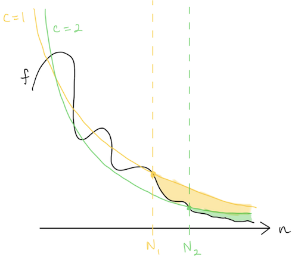
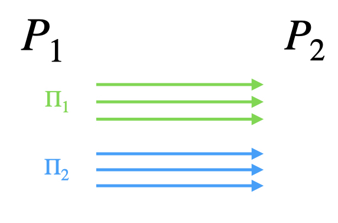

# Glossary

## General
**Advantage**
: The probability of an _adversary_ violating the security property of a scheme. The advantage is generally defined with respect to a _security game_. For secure constructions, the adversary's advantage usually shown to be small by showing it is bounded by a _negligible function_.

**Adversary**
: Some dishonest entity that will try to break a primitive or protocol. See [Threat Models](#threat-models) for the types of adversaries, each with different capabilities.

**Black-box**
: Treating some algorithm or protocol as a "black box" that hides the inner mechanism, allowing only the inputs and outputs to be seen.

**Correctness**
: A property of a scheme that ensures it works correctly and does not trivially meet the definition of the scheme. For example, we usually require that decryption and encryption are inverses, or that sharing and reconstruction are inverses.

**Deterministic**
: A function that always proceeds in the same way when run on the same outputs. Alternatively, the inputs directly determine the output. Compare to _randomized_.

**Feasibility result**
: 

**Field**
: A set of elements F with two binary operations + and • (addition and multiplication) that satisfy a set of properties called the [field axioms](https://en.wikipedia.org/wiki/Field_(mathematics)#Classic_definition) (specifically associativity, commutativity, identity, and invertibility of both operations along with distributivity of multiplication over addition). Both the rational numbers and the real numbers are fields.

**Functionality**
: A particular set of capabilities or properties to be achieved. For example, many protocols exist that implement the functionality of public key encryption. In this way, a functionality is abstract and independent of implementation details, and cryptosystems are build to achieve a functionality. Often, to prove security, a protocol is compared to an _ideal_ functionality, to show that it meets the same security properties.

**Function**
: A mathematical object that maps each input to at most one output.

**Group**
: A set of elements $G$ with some binary operation • (the group operation) that satisfies a set of properties called the [group axioms](https://en.wikipedia.org/wiki/Group_(mathematics)#Definition) (specifically associativity, identity, and invertibility). The integers form a group under addition.

**Hardness assumption**
: A problem, such as factoring, which is assumed to be hard. A cryptographic scheme's security may hinge on the adversary not being able to solve this problem, and if the assumption turns out not to hold, the proof of security is invalidated.

**i.i.d.**
: Independent and identically distributed. Two random variables are i.i.d. if they have the same probability distribution and are independent of each other.

**Linear operations**
: Addition and scalar multiplication.

**Negligible function**
: A function that asymptotically (i.e. after some fixed point) decreases faster than any inverse polynomial:  

!!! info "Formal Definition"
    A function $f$ is negligible if for all natural numbers c, there exists a natural number $N$ such that $f(n) < n^{-c}$ for all $n > N$.

**Probabilistic polynomial time (PPT)**
: A potentially _probabilistic_ algorithm that runs in polynomially many steps. In cryptography, we usually consider PPT adversaries (polynomial in the _security parameter_).

**Protocol**
: A sequence of messages exchanged between parties to compute some functionality. A protocol specifies how parties should compute their messages based on their knowledge and the other parties' responses. Usually denoted by the variable &Pi;.

**Probabilistic**
: 

**Randomized**
: A function whose output is influenced by some additional source of randomness. Running the function twice on the same inputs may result in a different outcome. Compare to _deterministic_.

**Security game**
: A game is a challenge in which an attacker (called the adversary and usually denoted by a curly letter $\mathcal{A}$) is given some information and tries to break the security property of the scheme. A "wins" the game if it can give an answer that proves it broke the security property of the scheme. See ["Game-based security"](#game-based-security).
<!-- TODO: link to an example game, e.g. CCA -->

**Security parameter**
: Denoted by $\lambda$ (or sometimes $\kappa$ for computational security), this is a measure of how hard it is to break the security of a system. 
Generally, an adversary's _advantage_ in attacking a scheme should be negligible in the security parameter; thus, the parameter needs to be large enough that the specific negligible function also corresponds to a sufficiently low success probability in practice.
Computational security parameters are generally $\lambda = 128$ or $\lambda = 256$ and correspond to the size of the instance of the computational problem to be solved; information-theoretic security parameters can be lower and corresponds directly to an adversary's statistical success probability. [See also the [Wikipedia page](https://en.wikipedia.org/wiki/Security_parameter)]

**Sybil attack**
: Attack in which an adversary creates multiple fake identities (parties) it controls in order to increase its influence in a network. To an outside observer these machines can't be distinguished from other honest parties/identities. One way to prevent this is asking new users to perform a somewhat costly registration process as a way to rate-limit creating new identities.

**Uniform**
: A distribution is uniform, or a value uniformly distributed, if every outcome is equally likely. We may say that a value is "drawn uniformly at random". A uniform distribution over N elements means each of the elements is drawn with probability 1/N.

**Unary**
: Compared to binary, which represents numbers using two symbols (0 and 1), the _unary_ representation of a number consists only of 1s. Specifically, a number n is represented in unary as a string of n 1s (e.g., 5 in unary would be 11111). _Security parameters_ are usually given as input in their unary representation, i.e. $1^\lambda$.

**Without loss of generality**
: 

**w.h.p.**
: With high probability.

### Complexity Theory

**Big-O notation**
: Written $O(n)$, this is an upper bound on the computational complexity of an algorithm/protocol/etc. when $n$ is large enough.

**Big-omega notation**
: Written $\Omega(n)$, this is a lower bound on the computational complexity of an algorithm/protocol/etc. when $n$ is large enough.

**Big-theta notation**
: Written $\Theta(n)$, this is an approximation of the computational complexity of an algorithm/protocol/etc. when $n$ is large enough. A function $f(n)$ is Big-Theta of $n$ (written as $f(n) \in \Theta(n)$) iff $f(n) \in O(n)$ and $f(n) \in \Omega(n)$.

**Polylog(n)**
: Polynomial in the logarithm, i.e. $poly(\log(n))$.

<!-- TODO: drawing of O/Omega/Theta and f(n) --->

### Composition

**Concurrent composition**
: Two protocols $\Pi_1, \Pi_2$ running concurrently are run with their messages arbitrarily interleaved. In the two-party case:
  
In general, concurrent composition of secure protocols does not maintain security (against malicious adversaries). A special case of concurrent composition is _parallel composition_. Compare to _sequential composition_.
 
**Parallel composition**
: Two protocols $\Pi_1, \Pi_2$ running in parallel run in "lockstep", i.e. the first round messages of both are sent together, followed by the second, and so on. In the two-party case:
  
In general, composing secure protocols in parallel does not maintain security (against malicious adversaries). Parallel composition is a special case of _concurrent composition_. Compare to _sequential composition_.

**Hybrid composition**
: <!-- TODO --> 
!!! info "Composition Theorem"
    If $\rho_1, \ldots, \rho_m$ are secure protocols for computing the functionalities $f_1, \ldots, f_m$, and if $\Pi$ is a secure protocol for computing $f$ in the $(f_1, \ldots, f_m)$-hybrid world, then the composed protocol $\Pi^{\rho_1, \ldots, \rho_m}$ is a secure protocol for $f$. That is, if we have a protocol that can secure compute some function $f$ given it has access to some other functionality/ies, and we have protocols for securely computing those functionality/ies, we can "plug in" those protocols into our main protocol and it will be secure.

**Sequential composition**
: Two protocols are composed sequentially when they are run back-to-back, i.e. one protocol only begins after the other has concluded. In the two-party case:  
  
Sequential composition of two secure protocols is still secure. Compare to _concurrent composition_, _parallel composition_.

## Areas of Cryptography

**Program Obfuscation**
: hide the inner workings (and secrets) of a program cryptographically while preserving functionality. 
 
**Virtual-black-box (VBB) security**
: The strongest notion of program obfuscation; it says that the obfuscated program acts as a black box. <!-- is there an impossibility result for this? -->
 
**Indistinguishability obfuscation (iO)**
: Usually styled as $\mathcal{iO}$. <!-- todo -->

**Quantum Cryptography**
: Rebuilding cryptographic primitives and cryptosystems that run on (and take advantage of the properties of) quantum computers.

**Rational Cryptography**
: 

## Cryptographic Primitives

Basic building blocks for cryptographic protocols.

**Commitment scheme**
: 
- **Vector commitment**
:  
- **Shrinking commitment**
:<!-- used when we want the pk to be small? -->

**Hash function**
: 
**Cryptographic hash function**
: 

**Key Agreement**
: 

**Key Encapsulation Mechanism (KEM)**
: 

**Message authentication code (MAC)**
: 

**One-way function (OWF)**
: In a way this is also an assumption, since we don't know of any function that is provably hard to invert.

**Pseudo-random function (PRF)**
: A function that maps inputs to outputs so that the outputs appear randomly distributed. The function is deterministic in the sense that querying it on the same input always returns the same (random-looking) output.

**Pseudo-random permutation (PRP)**
: 

**Encryption**
: Encryption schemes are used to ensure _confidentiality_. [More about encryption &rarr;](primitives/encryption.md)

**Signatures**
: Signatures are used to ensure _integrity_. [More about signatures &rarr;](primitives/signatures.md)

**Time-Lock Puzzle (TLP)**
: 

**Trapdoor function**
: 
**Lossy trapdoor function**
: 

## Standard Techniques

**Fiat-Shamir (FS) Transform**
: 

**Fujisaki-Okamoto (FO) Transform**
: 

## Threat Models

**Malicious adversary**
: An adversary that can deviate arbitrarily from the protocol it is participating in. That is, it doesn't follow the rules and may send malformed, empty, or incorrect messages, not send a message when it is supposed to or vice versa, and otherwise behave maliciously. Also known as **active adversary**; compare to _semi-honest adversary_.

!!! info 
    We sometimes use * as a superscript to denote that a party may be malicious, i.e. cheat and deviate from the protocol. For instance, the party $S^*$ in a commitment scheme denotes a potentially malicious sender.

**Semi-honest adversary**
: An adversary that follows the protocol and acts honestly, but tries to learn as much as possible from the information it sees. Also known as **honest-but-curious (HbC)** or **passive**.

!!! warning "Less standard threat models"
    The following threat models are newer and thus less widely used than the ones until now. It's possible different papers use different terms for them or that the names will change in the future.

**Fail-stop adversary**
: Slightly stronger than the semi-honest adversary; follows the protocol the way a semi-honest adversary does, but can choose to abort at any time (or cause parties it controls to abort).

**Semi-malicious adversary**
: Lies between the semi-honest and malicious cases. The adversary must follow the protocol, but it can arbitrarily and adaptively choose the inputs and randomness used in the protocol. [[BHP17 §4](https://eprint.iacr.org/2017/386.pdf); introduced by [AJL+12 §5](https://www.tau.ac.il/~tromer/papers/tfhe-mpc.pdf)]

## Security Definitions & Notions

**Adaptive security**
: Secure against an **adaptive adversary**, which can choose its actions dynamically and based on the responses of a game/protocol/etc. Also called **full security**.

**Computational security**
: The security scheme can be [reduced](proofs.md) to solving some problem that is [assumed to be computationally hard](assumptions.md), i.e. its security rests on a computational assumption.

**Covert security**
: 

**Forward secrecy**
: In key agreement protocols, this is the guarantee that the compromise of long-term secrets in some session $t$ does not affect the security of any sessions that took place before $t$ (i.e., those messages still cannot be decrypted). This also implies that the compromise of the session key for $t$ does not expose previous sessions.

**Game-based security**
: Security is defined by a _security game_ in which an attacker should have _negligible_ _advantage_. For example, [CPA- and CCA-security](primitives/encryption.md#security-notions).

<!-- Table of security games. 
Columns: name, primitive (Enc, MAC, etc.), weaker/stronger than -->

**Knowledge assumption**
:  

**Information-theoretic security**
: ... See also _unconditional security_.

**Perfect security**
: 

**Selective security**
: In this case, the adversary must pick (select) its messages/queries upfront. Also called **non-adaptive** or **static security**. Compare to _adaptive security_.

**Statistical security**
: Another term for _information-theoretic security_.

**UC security**
: Universal composability. A [simulation-based](proofs.md) security notion; schemes which are proven UC-secure are guaranteed to maintain their security properties even under arbitrary [composition](glossary.md#composition).

**Unconditional security**
: Usually used interchangeably with _information-theoretic security_. However, it can also be used to mean security that is not based on any computational assumption.

## Models

!!! info 
    The phrase used is "`Scheme` is secure in the `X` model".
    <!-- "In the __-hybrid model"? -->

**Oracle**
: 

**Algebraic Group Model (AGM)**
: This is a stronger assumption than the _standard model_, but weaker than the _GGM_. The model assumes that the adversary is algebraic, meaning that for any group element it outputs, it also knows the representation of the group. This differs from the GGM in that the adversary knows and can exploit the group structure.

**Generic Group Model (GGM)**
: This model assumes that the adversary is given access to a randomly chosen (encoding of a) group instead of the groups used in practice, which have efficient encodings. The adversary also has access to an oracle for the group function.
(Can see this as an analogue of giving the adversary access to a _random oracle_ instead of a real hash function used in practice.)

**Random Oracle Model (ROM)**
: A proof paradigm that models hash functions as random oracles, i.e. an oracle that outputs a random number for any input (but outputs the same number when given the same input). Read more [here](https://blog.cryptographyengineering.com/2020/01/05/what-is-the-random-oracle-model-and-why-should-you-care-part-5/).

**Standard Model**
: This model assumes only that the adversary is limited by time or computational power; it makes no further assumptions (the way, e.g., the ROM does). Proofs in the standard model therefore usually rest on a computational hardness assumption, but no idealized cryptographic primitives, and are thus very difficult. In this way this model is "better" than the others listed here because it assumes less.  
Also known as the **bare model** or **plain model**.