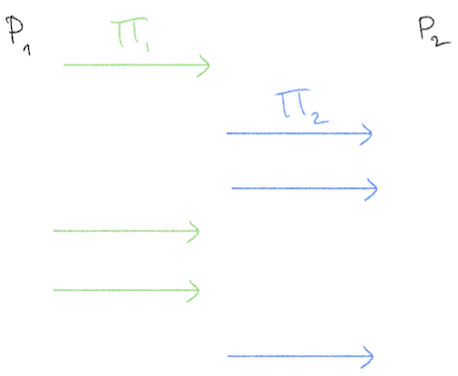
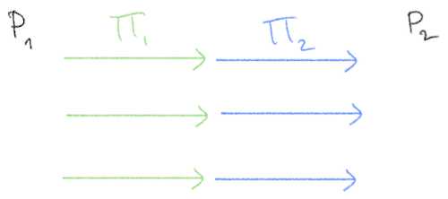
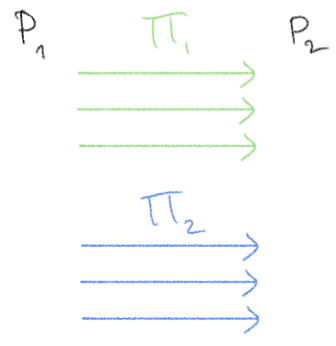

# Glossary

[General](#general) | [Primitives](#primitives) | [Areas of Crypto](#areas-of-cryptography) | [Threat Models](#threat-models) | [Phrases](#phrases) | [Models](#models)

## General
**Advantage**:

**Adversary**: Some dishonest entity that will try to break a primitive or protocol. See [Threat Models](#threat-models) for the types of adversaries, each with different capabilities.

**Concurrent composition**: Two protocols running concurrently are run with their messages arbitrarily interleaved. In the two-party case:

In general, concurrent composition of secure protocols does not maintain security (against malicious adversaries). A special case of concurrent composition is _parallel composition_. Compare to _sequential composition_.

**Correctness**:

**Deterministic**: A function that always proceeds in the same way when run on the same outputs. Alternatively, the inputs directly determine the output. Compare to _randomized_.

**Field**: A set of elements _F_ with two binary operations + and • (addition and multiplication) that satisfy particular properties called the [field axioms](https://en.wikipedia.org/wiki/Field_(mathematics)#Classic_definition) (specifically associativity, commutativity, identity, and invertibility of both operations along with distributivity of multiplication over addition). Both the rational numbers and the real numbers are fields.

**Functionality** vs. **function**:

**Group**: A set of elements _G_ with some binary operation • (the group operation) that satisfies particular properties called the [group axioms](https://en.wikipedia.org/wiki/Group_(mathematics)#Definition) (specifically associativity, identity, and invertibility). The integers form a group under addition.

**Hardness/security assumption**:

**Hybrid composition**: 
- **Composition Theorem.** If &rho;_1_, ..., &rho;_m_ are secure protocols for computing the functionalities _f1_, ..., _fm_, and if &Pi; is a secure protocol for computing _f_ in the (_f1_, ..., _fm_)-hybrid world, then the composed protocol &Pi;^&rho;_1_, ..., &rho;_m_ is a secure protocol for _f_.
That is, if we have a protocol that can secure compute some function _f_ given it has access to some other functionality/ies, and we have protocols for securely computing those functionality/ies, we can "plug in" those protocols into our main protocol and it will be secure.

**i.i.d.**: Independent and identically distributed. Two random variables are i.i.d. if they have the same probability distribution and are independent of each other.

**Parallel composition**: Two protocols running in parallel run in "lockstep", i.e. the first round messages of both are sent together, followed by the second, and so on. In the two-party case:

In general, composing secure protocols in parallel does not maintain security (against malicious adversaries). Parallel composition is a special case of _concurrent composition_. Compare to _sequential composition_.

**Protocol**: A sequence of messages exchanged between parties to compute some functionality. A protocol specifies how parties should compute their messages based on their knowledge and the other parties' responses. Usually denoted by the variable &Pi;.

**Randomized**: A function whose output is influenced by some additional source of randomness. Running the function twice on the same inputs may result in a different outcome. Compare to _deterministic_.

**Security game**:

**Sequential composition**: Two protocols are composed sequentially when they are run back-to-back, i.e. one protocol only begins after the other has concluded. In the two-party case:

Sequential composition of two secure protocols is still secure. Compare to _concurrent composition_, _parallel composition_.

**Uniform**: A distribution is uniform, or a value uniformly distributed, if every outcome is equally likely. We may say that a value is "drawn uniformly at random". A uniform distribution over _N_ elements means each of the elements is drawn with probability 1/_N_.

**Without loss of generality**: 

## Cryptographic Primitives

Basic building blocks for cryptographic protocols.

**Pseudo-random function (PRF)**: A function that maps inputs to outputs so that the outputs appear randomly distributed. The function is deterministic in the sense that querying it on the same input always returns the same (random-looking) output.

## Areas of Cryptography
**Consensus**:

**Lattice-based cryptography**: Cryptography based on lattice hardness assumptions.

**Multi-party computation (MPC)**: Functionality in which two or more parties with secret inputs compute a joint function on those inputs. No party learns any more information about the others' inputs, except what it can infer from the output. [More about MPC &rarr;](./mpc.md)

**Post-quantum cryptography (PQC)**: Cryptographic primitives that are secure against adversaries with quantum capabilities. _Lattice-based cryptography_ is one area of PQC.

**Private set intersetion (PSI)**:

**Zero-knowledge proofs**: [More about zero-knowledge &rarr;](./zk.md)

## Threat Models
**Active adversary**: See _malicious adversary_.

**Passive adversary**: See _semi-honest adversary_.

**Malicious adversary**:

**Semi-honest adversary**:

**Perfect security**:

**Statistical security**: See _information-theoretic security_.

**Information-theoretic security**:

**Computational security**:

## Phrases
**Secure in the __ model**:

**In the __-hybrid model**:

**Black-box**:

## Models
**Generic Group Model (GGM)**:

**Random Oracle Model (ROM)**: