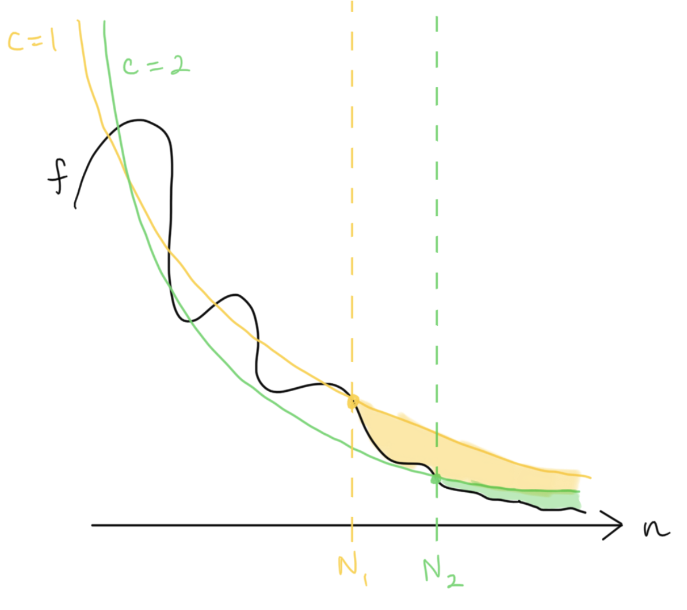

# Glossary

[General](#general) | [Areas of Crypto](#areas-of-cryptography) | [Primitives](#cryptographic-primitives) | [Threat Models](#threat-models) | [Phrases](#phrases) | [Models](#models)

## General
**Advantage**: The probability of an _adversary_ violating the security property of a scheme. The advantage is generally defined with respect to a _security game_. For secure constructions, the adversary's advantage usually shown to be small by showing it is bounded by a _negligible function_.

**Adversary**: Some dishonest entity that will try to break a primitive or protocol. See [Threat Models](#threat-models) for the types of adversaries, each with different capabilities.

**Complexity Theory**:
- **Big-O notation**: Written O(n), this is an upper bound on the computational complexity of an algorithm/protocol/etc. when n is large enough.

- **Big-omega notation**: Written &Omega;(n), this is a lower bound on the computational complexity of an algorithm/protocol/etc. when n is large enough.

- **Big-theta notation**: Written &Theta;(n), this is an approximation of the computational complexity of an algorithm/protocol/etc. when n is large enough. A function _f(n)_ is Big-Theta of n (written as _f(n) &isin; &Theta;(n)_) iff _f(n) &isin; O(n)_ and _f(n) &isin; &Omega;(n)_.

<!-- TODO: drawing of O/Omega/Theta and f(n) --->

**Composition**:
- **Concurrent composition**: Two protocols &Pi;1, &Pi;2 running concurrently are run with their messages arbitrarily interleaved. In the two-party case:

In general, concurrent composition of secure protocols does not maintain security (against malicious adversaries). A special case of concurrent composition is _parallel composition_. Compare to _sequential composition_.

- **Hybrid composition**: 
  - > **Composition Theorem.** If &rho;_1_, ..., &rho;_m_ are secure protocols for computing the functionalities _f1_, ..., _fm_, and if &Pi; is a secure protocol for computing _f_ in the (_f1_, ..., _fm_)-hybrid world, then the composed protocol &Pi;^&rho;_1_, ..., &rho;_m_ is a secure protocol for _f_.

  That is, if we have a protocol that can secure compute some function _f_ given it has access to some other functionality/ies, and we have protocols for securely computing those functionality/ies, we can "plug in" those protocols into our main protocol and it will be secure.

- **Parallel composition**: Two protocols &Pi;1, &Pi;2 running in parallel run in "lockstep", i.e. the first round messages of both are sent together, followed by the second, and so on. In the two-party case:

In general, composing secure protocols in parallel does not maintain security (against malicious adversaries). Parallel composition is a special case of _concurrent composition_. Compare to _sequential composition_.

- **Sequential composition**: Two protocols are composed sequentially when they are run back-to-back, i.e. one protocol only begins after the other has concluded. In the two-party case:

Sequential composition of two secure protocols is still secure. Compare to _concurrent composition_, _parallel composition_.

**Correctness**: A property of a scheme that ensures it works correctly and does not trivially meet the definition of the scheme. For example, we usually require that decryption and encryption are inverses, or that sharing and reconstruction are inverses.

**Deterministic**: A function that always proceeds in the same way when run on the same outputs. Alternatively, the inputs directly determine the output. Compare to _randomized_.

**Field**: A set of elements _F_ with two binary operations + and • (addition and multiplication) that satisfy particular properties called the [field axioms](https://en.wikipedia.org/wiki/Field_(mathematics)#Classic_definition) (specifically associativity, commutativity, identity, and invertibility of both operations along with distributivity of multiplication over addition). Both the rational numbers and the real numbers are fields.

**Functionality** vs. **function**:

**Group**: A set of elements _G_ with some binary operation • (the group operation) that satisfies particular properties called the [group axioms](https://en.wikipedia.org/wiki/Group_(mathematics)#Definition) (specifically associativity, identity, and invertibility). The integers form a group under addition.

**Hardness assumption**: A problem, such as factoring, which is assumed to be hard. A cryptographic scheme's security may hinge on the adversary not being able to solve this problem, and if the assumption turns out not to hold, the proof of security is invalidated.

**i.i.d.**: Independent and identically distributed. Two random variables are i.i.d. if they have the same probability distribution and are independent of each other.

**Negligible function**: A function that asymptotically (i.e. after some fixed point) decreases faster than any inverse polynomial:

Formal Definition

A function <emph>f</emph> is negligible if for all natural numbers <emph>c</emph>, there exists a natural number <emph>N</emph> such that <emph>f(n) < n^{-c}</emph> for all <emph>n > N</emph>.

**Protocol**: A sequence of messages exchanged between parties to compute some functionality. A protocol specifies how parties should compute their messages based on their knowledge and the other parties' responses. Usually denoted by the variable &Pi;.

**Randomized**: A function whose output is influenced by some additional source of randomness. Running the function twice on the same inputs may result in a different outcome. Compare to _deterministic_.

**Security game**:

**Uniform**: A distribution is uniform, or a value uniformly distributed, if every outcome is equally likely. We may say that a value is "drawn uniformly at random". A uniform distribution over _N_ elements means each of the elements is drawn with probability 1/_N_.

**Without loss of generality**: 

## Areas of Cryptography
**Consensus**: [More about consensus &rarr;](./consensus.md)

**Lattice-based cryptography**: Cryptography based on lattice hardness assumptions.

**Multi-party computation (MPC)**: Functionality in which two or more parties with secret inputs compute a joint function on those inputs. No party learns any more information about the others' inputs, except what it can infer from the output. [More about MPC &rarr;](./mpc.md)

**Post-quantum cryptography (PQC)**: Cryptographic primitives that are secure against adversaries with quantum capabilities. _Lattice-based cryptography_ is one area of PQC.

**Private set intersetion (PSI)**:

**Program Obfuscation**: hide the inner workings (and secrets) of a program cryptographically while preserving functionality. The strongest notion of security here is virtual-black-box (VBB) security, which means that the obfuscated program acts as a black box.

**Quantum Cryptography**:

**Zero-knowledge proofs**: Ways to prove knowledge of a piece of information without revealing that information. More specifically, the goal is usually to prove knowledge of a _witness_ for some _statement_ in a _language_ without revealing the witness. [More about zero-knowledge &rarr;](./zk.md)

## Cryptographic Primitives

Basic building blocks for cryptographic protocols.

**Pseudo-random function (PRF)**: A function that maps inputs to outputs so that the outputs appear randomly distributed. The function is deterministic in the sense that querying it on the same input always returns the same (random-looking) output.

**Pseudo-random permutation (PRP)**:

### Encryption Schemes
Encryption schemes are used to ensure _confidentiality_.

**Asymmetric (public-key) encryption**: One key (the recipient's public key) is used for encryption, while another key (the corresponding secret key) is used for decryption. The private and public keys for a key pair. Example schemes:

- **ElGamal encryption**: For a cyclic group G of order q with generator g, the secret key is _x_, a uniformly chosen element of G; the public key is _(G, q, g, h:=g^x)_.
  - Enc(m &isin; G): choose a uniform element _y &isin; G_; return _(c1 := g^y, c2 := m h^y = m g^(xy))_
  - Dec(c1,c2): let _s := c1^x = g^(xy) = h^y_ and compute _s^(-1)_. Then _m_ is recovered as _c2 s^(-1) = m h^y (h^y)^(-1) = m_.

- **RSA encryption**:

**Symmetric (secret-key) encryption**: The same key is used for both decryption and encryption. This means the sender and recipient must somehow securely agree on a secret key; this is usually achieved either via _key agreement_ protocols or by encrypting the symmetric key using public-key encryption. Example symmetric key encryption schemes:

- **Advanced Encryption Standard (AES)**:
- **One-time Pad**:

### Signatures
Signatures are used to ensure _integrity_.

**Schnorr signatures**:

**ECDSA signatures**:

### Cryptographic Schemes
These are active lines of research creating particular schemes or primitives that to me don't seem quite large enough to be their own area and are new enough not to fall under the "classic" crypto primitives [above](#cryptographic-primitives).

**Attribute-based encryption (ABE)**: Policy-based access to encrypted data (general case of identity-based encryption (IBE)). The policy is public. A trusted third-party distributes keys to parties that meet the policy.

**Functional encryption (FE)**: An encryption scheme in which it is possible to issue "function keys", e.g. a key _k_f_ that decrypts the ciphertext into a function _f(m)_ of the plaintext _m_.

**Identity-based encryption (IBE)**:

**Message authentication code (MAC)**:

**Time-Lock Puzzle (TLP)**:

## Threat Models
**Malicious adversary**: 
An adversary that can deviate arbitrarily from the protocol it is participating in. That is, it doesn't follow the rules and may send malformed, empty, or incorrect messages, not send a message when it is supposed to or vice versa, and otherwise behave maliciously. Also known as **active adversary**; compare to _semi-honest adversary_.

> We sometimes use * as a superscript to denote that a party may be malicious, i.e. cheat and deviate from the protocol. For instance, the party S* in a commitment scheme denotes a potentially malicious sender.

**Semi-honest adversary**: An adversary that follows the protocol and acts honestly, but tries to learn as much as possible from the information it sees. Also known as **honest-but-curious (HbC)** or **passive**.

## Security Notions

**Adaptive security**:

**Computational security**:

**Information-theoretic security**: ... See also _unconditional security_.

**Perfect security**:

**Semantic security**:

**Statistical security**: Another term for _information-theoretic security_.

**Unconditional security**: Usually used interchangeably with _information-theoretic security_. However, it can also be used to mean security that is not based on any computational assumption.

## Phrases
**Secure in the __ model**:

**In the __-hybrid model**:

**Black-box**: Treating some algorithm or protocol as a "black box" that hides the inner mechanism, allowing only the inputs and outputs to be seen.

## Models

**Oracle**:

**Algebraic Group Model (AGM)**:

**Generic Group Model (GGM)**: This model assumes that the adversary is given access to a randomly chosen (encoding of a) group instead of the groups used in practice, which have efficient encodings. The adversary also has access to an oracle for the group function.
(Can see this as an analogue of giving the adversary access to a _random oracle_ instead of a real hash function used in practice.)

**Random Oracle Model (ROM)**: A proof paradigm that models hash functions as random oracles, i.e. an oracle that outputs a random number for any input (but outputs the same number when given the same input). Read more [here](https://blog.cryptographyengineering.com/2020/01/05/what-is-the-random-oracle-model-and-why-should-you-care-part-5/).

**Standard Model**: This model assumes only that the adversary is limited by time or computational power; it makes no further assumptions (as in the ROM or GGM). Proofs in the standard model therefore usually rest on a computational hardness assumption, but no idealized cryptographic primitives, and are thus very difficult. In this way this model is "better" than the others listed here because it assumes less. Also known as the **bare model** or **plain model**.