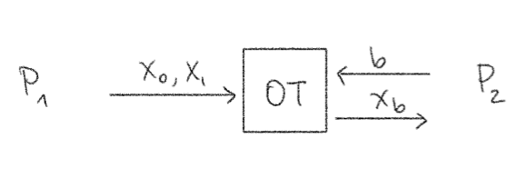

[← Back to Glossary](../glossary.md)

# Multi-Party Computation

Sometimes also referred to as secure multi-party computation (SMC), multi-party computation (MPC) is a functionality in which two or more parties with secret inputs want to compute a joint function  on those inputs. More explicitly, for N parties with inputs , an MPC protocol takes those inputs and outputs .

The protocol should meet a couple of conditions to be interesting/useful:
* **Security.** None of the parties learn anything about the other parties' inputs (except what they can deduce from the output)
* **Correctness.**  should be correct. That is,  should in fact be the function  applied to the parties' inputs – no errors.
 

Why is this useful? A simple example is Yao's Millionaries' Problem. Two millionaires want to know who's richer, but they don't want to reveal exactly how rich they are. They can run an MPC protocol where the inputs are their net worths and the function  computes the sign of , for example

 x_2\\
0 	& x_1 = x_2\\
-1 	& x_1 < x_2
\end{cases}" src="https://render.githubusercontent.com/render/math?math=f%28x_1%2C%20x_2%29%20%3D%20%5Cbegin%7Bcases%7D%0A1%20%09%26%20x_1%20%3E%20x_2%5C%5C%0A0%20%09%26%20x_1%20%3D%20x_2%5C%5C%0A-1%20%09%26%20x_1%20%3C%20x_2%0A%5Cend%7Bcases%7D"/>

There are more serious real-world applications for this too. You could imagine using this to let hospitals collaborate on health analytics without sharing their patient records and other similar use cases.

## Building Blocks

**Beaver Triples**: For any variable d, let [d] denote a party's share of d. Assuming parties hold _secret shares_ of values x,y,a,b,c=ab for uniform a,b, they can compute shares of z=xy as follows:
1. Publicly reconstruct x-a, y-b:
  * Locally compute shares of x-a, y-b
  * Broadcast shares to reconstruct
2. Use local computation to get shares of z:
  * Each party sets its share [z] = [c] + (y-b)[x] + (x-a)[y] - (x-a)(y-b)
  * Note that these are shares of xy!
 

**Cut-and-choose**: This is an idea used to turn a semi-honest MPC protocol into a malicious-secure one. Whenever we rely on the well-formedness of some (potentially malicious) party's inputs, we use the following idea to guarantee their well-formedness: we ask the party to generate many values, then challenge it on a randomly selected fraction of them. The party opens this subset, and if they are all well-formed/honestly generated, the unopened half is used in the protocol. By a statistical argument, these are very likely also well-formed.

**Oblivious Transfer (OT)**: Functionality in which one party holds two strings and the other a selection bit _b_. The second party learns the string corresponding to its selection bit and nothing more, while the first party learns nothing about the selection bit.

OTs with different numbers exist, such as 1-out-of-4 OT (P2 selects one of four choices) or more generally 1-out-of-n OT for some parameter n.

**Secret-sharing**: Splitting a secret between parties so that none of the parties know the secret, but they each have a piece of the information, and if they work together they can recover the secret. Here's a visual intuition:

Schemes:
* **Exclusive OR (XOR) secret-sharing**: For a secret _s_, set Party _i_'s share to some random value , except for a designated party which gets . The shares XOR together to _s_, but each individual share looks random.
* **Shamir secret-sharing**: This is a form of (t+1)-out-of-n secret-sharing, i.e., at least t+1 out of n parties must work together to recover the secret. Shamir secret-sharing gives every party a point on a degree-t polynomial. Because t+1 points define a unique polynomial, t+1 parties can work together to recover it. The secret is the value when the polynomial is evaluated at 0. Interactive demo [here](./ShamirSS.ipynb).
 

Secret-sharing schemes with additional properties also exist, but basic secret sharing usually suffices for MPC.
* **Function secret sharing (FSS)**:
* **Homomorphic secret sharing (HSS)**:
* **Robust secret sharing**: Does not consider a corrupt dealer. ...
* **Verifiable secret sharing (VSS)**: Protects against a corrupt dealer. During the sharing phase, the parties who receive shares from the dealer also run a verification function to confirm that the shares they received are well-formed (will reconstruct properly).
 

**MPC-in-the-head**:

## Protocol Characteristics

**Corruption type**: Semi-honest, malicious, etc.

**Corruption threshold** (t): Honest majority (t < n/2), dishonest majority (t < n), etc.

**Hardness assumptions**:

**Trusted setup**:

**Security guarantees**:
* **Guaranteed output delivery (GOD)**: The strongest type of correctness guarantee. In a protocol with GOD, an adversary cannot even carry out a denial-of-service attack; the (correct) output will always be learned by the participants.
* **Identifiable abort**:
* **Security with abort**:
## Protocols

Most MPC protocols turn the function to compute into a circuit representation (yes, like in electrical engineering with AND gates and whatnot).

**Yao's Garbled Circuits (GC)**: One party (the garbler) "garbles" the circuit by successively encrypting wire keys. The other party (the evaluator) follows the path of correct decriptions through the circuit until it obtains the keys corresponding to the output value.
* _Assumptions:_ Secure OT
* _Optimizations:_ Point-and-permute, PRF for encryption, garbled row reduction, half-gates, free XOR.
 

**Goldreich–Micali–Wigderson (GMW)** (semi-honest version): Construct gates so that parties can step through the circuit using XOR-shares of wires. Multiplication gates require 1-out-of-4 OT to communicate the correct output shares.
* _Assumptions:_ Secure OT
 

**Goldreich–Micali–Wigderson (GMW)** (malicious version): Same as semi-honest, but use zero-knowledge proofs to ensure well-formedness.
* _Assumptions:_ Secure OT, ZK
 

**Ben-Or–Goldwasser–Wigderson (BGW)**: Same structure as GMW but over arithmetic circuits (where wires carry field elements). So, instead of using XOR-shares, use (t+1)-out-of-n Shamir secret-sharing. Multiplication gates use a degree-reduction step to maintain the invariant that parties hold well-formed wire value shares.
* _Assumptions:_ None!
 

**Chaum–Crepeau–Damgård (CCD)**:

**Beaver–Micali–Rogaway (BMR)**: This can be viewed as an adaptation of Yao's garbled circuit approach to more than two parties while keeping its low round complexity. Use GMW to compute a garbled circuit for the function to evaluate; then, one party evaluates the garbled circuit.
* _Assumptions:_ Secure OT
 

**Cramer–Damgård–Nielsen (CDN)**:
* _Assumptions:_ Threshold homomorphic encryption

### Tabular Summary

`n`: number of circuit gates

`d`: depth of circuit

<!-- <embed type="text/html" src="../src/subareas/mpc_table.html"></embed> -->

Year | Name | Number of parties | Threat Model | Round Complexity | Communication Complexity | Circuit Representation
:----|:-----|:-----------------:|:-------------|:----------------:|:-----------------------:|:-----------
1986 | Yao's GC | 2    | < 2 semi-honest   | O(1) | O(n) | Boolean
1987 | GMW      | many | < n semi-honest   | O(d) | O(1) | Boolean
&#8203;|        | many | < n malicious     |      |      | Boolean
1988 | BGW      | many | < n/2 semi-honest | O(d) | O(d) | Arithmetic
&#8203;|        | many | < n/3 malicious   | O(d) |      | Arithmetic
1988 | CCD      | many |                   |      |      |
1990 | BMR      | many | < n               | O(1) |     | Boolean
2001 | CDN      | many | < n/2 malicious   | O(d) | O(n) | Arithmetic

## Extensions to basic MPC

**Non-interactive MPC (NI-MPC)**:

**Non-interactive 2PC**:

## References

**Yao's GC**: [Original paper](https://ieeexplore.ieee.org/document/4568207)

**GMW**:

**BGW**: Original paper, [full proof](https://eccc.weizmann.ac.il//report/2011/036/)

**BMR**: [Original paper](https://dl.acm.org/doi/pdf/10.1145/100216.100287?casa_token=jgHhj-wpD88AAAAA:17nxjtduFXBZwYyyvRd9sVKdnPBXZ-vaBxXxzmHFQwhZy_dRc1UGxRnmoXj6WlNRflZ-wRlQA0v-iA), [Rogaway's Thesis](https://www.cs.ucdavis.edu/~rogaway/papers/thesis.pdf), [Pragmatic Introduction to MPC, Section 3.5](https://securecomputation.org/)

